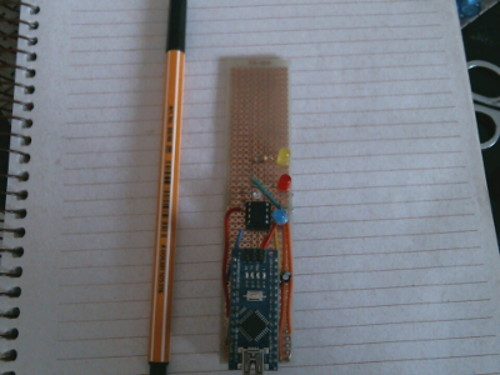

# Projetos AVR ATTiny85

Esse repositório contém alguns projetos para os microcontrolados [ATTiny85](https://www.microchip.com/wwwproducts/en/ATtiny85). Os projetos são organizados de acordo com a linguagem ou  kit de desenvolvimento utilizado:

Os projetos foram testados nas placas de desenvolvimento [Digispark](https://www.robocore.net/loja/itens-eletronicos/digispark-attiny85), que possuem o ATTiny85 e uma interface USB para fazer upload do código .hex para a memória flash do ship. Além disso, construi minha placa programadora, mostrada na figura abaixo, usando o Arduino Nano como [programador](https://fossbytes.com/arduino-isp-programming-atmel-attiny85/), conforme alguns tutoriais da internet, para que pudesse programar o chip Attiny13 ou Attiny85 sem que estivessem soldados numa placa de desenvolvimento, pois em projetos finais precisamos apenas do componente mesmo.

Dois vídeos que ensinam a fazer um programador utiluzando o Arduino Nano e o UNO:

### 1. ASM Projects

 O objetivo dos projetos aqui é estudar a linguagem assembly dos chips AVR, particularmente o ATTiny13 e ATTiny85, que são baratos e pequenos e suficientes para pequenos projetos de microeletrônica. Eles são muito simples simples do ponto de vista do que ele fazem, apenas ligarem leds por algum tempo e desligar, porém exigem um conhecimento da arquitetura dos processadores, o que para quem está acostumado com linguagens de alto nível não é tão simples assim. Para quem nunca tinha lidado com um datasheet antes, é normal nem saber por onde começar. 
 
Em assembly existem algumas formas de fazer um timer conforme o chip, no caso ATTiny85. temos dois temporizadores/contadores de 8 bits. Há duas formas de implementar um timer, uma é utilizando o modo CTC (_Clear Timer on Compare_) onde se realiza um contagem e calcula-se o tempo gasto da contagem de acordo com o clock da CPU, 8MHz no ATTiny85, podendo ser programado para rodar em 16MHz. A outra maneira é usar a técnica de modulação de pulso, PWM, onde gera-se uma onda (sinal) por um determinado tempo para ligar ou desligar o LED, speaker, etc.

Para entender qualquer programa assembly nesse repositório se faz necessário entender o funcionamento dos timers dos chips Atmel descritas nesse link [(Introduction to AVR Timers)](https://maxembedded.wordpress.com/2011/06/22/introduction-to-avr-timers/), principalmente o conceito de _prescaling_.

Uma boa introdução de como programar em Assembly para o Arduino, está nesse [link](https://www.instructables.com/id/Command-Line-Assembly-Language-Programming-for-Ard/), um tutorial de 11 partes, onde vc aprende os conceitos do assembly, como ler um datasheet e a preparar o ambiente de desenvolvimento no linux, além dos projeto em si.

[Datasheet](pdf/Datasheet-Attiny85.pdf) do ATTiny85

+ #### Blink LED CTC Mode

	[blink_led_ctc_mode.asm](https://github.com/eduardocl/attiny-projects/tree/master/ATTiny85/asm-projects/blink_led_asm_ctc_mode/blink_led_ctc_mode.asm) Timer implementado com CTC, rodando a 8MHZ com prescale de 16384.

	[blink_led_ctc_mode_pure_hardware.asm](https://github.com/eduardocl/attiny-projects/tree/master/ATTiny85/asm-projects/blink_led_asm_ctc_mode/blink_led_ctc_mode_pure_hardware.asm) Mesmo projeto acima, mas usando puramente o hardware, sem fazer comparações, apenas se popula os registradores e o hardware envia os sinais para o pino de saída quando atinge o valor de contagem máximo.

+ #### Blink LEC Overflow Mode

	[blink_led.asm](https://github.com/eduardocl/attiny-projects/tree/master/ATTiny85/asm-projects/blink_led_asm_ovf_count/blink_led.asm): timer implementado como contador, cada vez que atinge 255 o estado do LED muda de estado.

	[blink_led_16mhz.asm](https://github.com/eduardocl/attiny-projects/tree/master/ATTiny85/asm-projects/blink_led_asm_ovf_count/blink_led_16mhz.asm) timer rodando a 16MHz para o AVR atmega328p.

+ #### Push button LED

	Projeto em andamento para ligar e desligar um LED através de um botão, mas aparentemente o programa não está tratamento o problema de _"bouncing"_ na detecção do sinal lido do botão.

   **Não funciona ainda** :-)

### 2. 	AVR Projects
##### Projeto em linguagem C utilizando as libs da ATMEL

+ [ctc.c](https://github.com/eduardocl/attiny-projects/tree/master/ATTiny85/avr-projects/blink_led_c/ctc.c) Versão C do projeto [blink_led_ctc_mode.asm](https://github.com/eduardocl/attiny-projects/tree/master/ATTiny85/asm-projects/blink_led_asm_ctc_mode/blink_led_ctc_mode.asm)

+ [ctc_pure_hardware.c](https://github.com/eduardocl/attiny-projects/tree/master/ATTiny85/avr-projects/blink_led_c/ctc_pure_hardware.c): versão C do projeto [blink_led_ctc_mode_pure_hardware.asm](https://github.com/eduardocl/attiny-projects/tree/master/ATTiny85/asm-projects/blink_led_asm_ctc_mode/blink_led_ctc_mode_pure_hardware.asm)

+ [main.c](https://github.com/eduardocl/attiny-projects/tree/master/ATTiny85/avr-projects/blink_led_c/main.c): timer de 50ms para ligar/desligar um LED
     usando o TIMER0, com prescaler (divisor) de 64. (8MHz/64)

## Referências

1. [**AVR Assembler Tutorial**](https://www.instructables.com/id/Command-Line-Assembly-Language-Programming-for-Ard/)

2. [**Como programar a Digispark ATtiny85 com IDE Arduino**](https://www.arduinoecia.com.br/digispark-attiny85-ide-arduino/)

3. [**Attiny85 Datasheet**](pdf/Datasheet-Attiny85.pdf)

4. [**Introduction to AVR Timers**](https://maxembedded.wordpress.com/2011/06/22/introduction-to-avr-timers/)

5. [**Vídeo: O Menor Arduino do Mundo**](https://www.youtube.com/watch?v=FX5-94qjNuc)

6. [**Vídeo: ATTiny 85 Assembly**](https://www.youtube.com/watch?v=9HDLc40Gmac&t=5s)

7. [**Pinouts**](attiny13.md)
